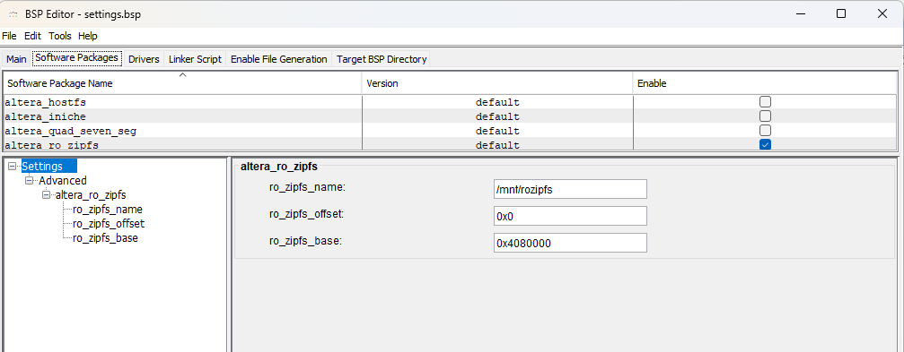
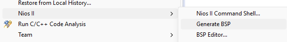
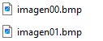

En este ejercicio vamos a utilizar las particiones de memoria de uC/OS-II para reservar memoria y procesar datos en ella.

El objetivo es leer datos de una memoria onChip que hay en el sistema de la DE1-SoC. En esta memoria se encuentran varios ficheros de imágenes a partir de la dirección `0x0408_0000`.

El tratamiento de estas imágenes consistirá en abrir ficheros mediante los comandos fopen, fclose, etc.. al estilo UNIX que posee el HAL de NIOS.

Poder utilizar estos comandos debemos verificar que en el BSP editor de nuestro sistema tenemos habilitado el sistema de ficheros.

<div align="center">
	
	<br>
	<em>Figura 23. rozipfs en BSP Editor.</em>
</div>

Se observa el nombre que se le ha dado al sistema de ficheros de la memoria `/mnt/rozipfs`, en la dirección base de la memoria `0x0408_0000` y el offset aplicado `0x000000`, si su sistema no tiene activado este sistema, créelo y genere el nuevo BSP.

¡Es posible que deba regenerar el BSP desde el menú NIOS II en la carpeta BSP del proyecto!


<div align="center">
    
    <br>
    <em>Figura 24. Generate BSP.</em>
</div>

Verifique en `system.h` que aparece el nuevo sistema de ficheros.

```c
/*
 * altera_ro_zipfs configuration
 *
 */

#define ALTERA_RO_ZIPFS_BASE 0x04080000
#define ALTERA_RO_ZIPFS_NAME "/mnt/rozipfs"
#define ALTERA_RO_ZIPFS_OFFSET 0x000000
```

Los ficheros pregrabados en la memoria son:

<div align="center">
    
    <br>
    <em>Figura 25. Ficheros en la memoria.</em>
</div>

De esta forma podremos buscar los ficheros por su nombre.

El ejercicio consiste en volcar los ficheros de imágenes en formato BMP sobre la pantalla VGA, es decir se deben leer de la memoria y mostrarlos en la VGA como imagen de background.

Para convertir un fichero BMP en formato RGB que sea legible desde la DMA hacia la VGA utilizamos la función `Read_BMP_ZipFile(char *file_name)`.

Esta función lee el fichero que obtiene como parámetro extrayendo las características de la imagen: alto y ancho y número de bits por píxel. Esta información se encuentra en la cabecera del fichero BMP. Una vez determinado el tamaño ya se puede ir obteniendo el valor de píxel resultante de la lectura de los bytes R, G y B del fichero, teniendo en cuenta que la lectura de las filas en formato BMP están invertidas respecto a la imagen real (la primera fila es la que se almacena la última en el fichero BMP).

Cada píxel obtenido se debe almacenar en una posición de memoria reservada por uC/OS-II.

Cada imagen tendrá su propia dirección de memoria reservada.

Al existir 2 imágenes a leer necesitamos crear una partición de memoria de 2 bloques. Cada bloque tendrá el tamaño necesario para almacenar una imagen de tamaño 320x240 píxels con 2 bytes por píxel (formato RGB565). Hay que tener en cuenta que la imagen se guarda utilizando direccionamiento X-Y.

En el fichero `init.h` podremos definir (falta definir el tamaño de bloque necesario para almacenar la imagen):

```c
// memory management
#define NUM_MEMORY_BLOCKS 2
#define NUM_BYTES_PACKET 

OS_MEM *ImageMemory;
INT16U PixelMem[NUM_MEMORY_BLOCKS][NUM_BYTES_PACKET]; //direcciones de 16b en la SDRAM

OS_MEM_DATA mem_data;

/* semaphore to control number of memory blocks */
OS_EVENT *SemaphoreMemory;
OS_EVENT *MutexMemory;
```

Y necesitamos crear la partición en `init.c`:

```c
// Mutex to protect entering one at time on memory
MutexMemory=OSMutexCreate(0,&error);
// Semaphore 4 levels for 4 images
SemaphoreMemory=OSSemCreate(4);

// memory allocation
ImageMemory= OSMemCreate(PixelMem, NUM_MEMORY_BLOCKS, NUM_BYTES_PACKET * sizeof(INT8U), &error);
alt_ucosii_check_return_code(error);
```

Se observa la inclusión de dos tipos de semáforos en el proceso:
1. Se crea un MUTEX para proteger los accesos a la memoria de forma que cuando se acceda se toma el mutex y cuando se ha leído el contenido de una imagen se devuelve el mutex.
2. Se crea un semáforo de nivel 2 para controlar las solicitudes de cada bloque de memoria de la partición. Cada bloque tomado (GET) irá precedido de una bajada de este semáforo.

En `init.h` se pueden definir los tipos `bool` que son utilizados por la función `Read_BMP_ZipFile(char *file_name)`.

```c
typedef enum e_bool { false = 0, true = 1 } bool;
```

## Tareas de control de imágenes de la FLASH.

Vamos a crear dos tareas nuevas: `TaskPicture` y `ShowPicture`.

`TaskPicture` se encarga de leer las cuatro imágenes de la memoria (p.e. una cada segundo), decodificar los píxeles del formato BMP y almacenarlos en cada bloque de la partición de memoria.

`ShowPicture` se encarga de trasladar (p.e. cada segundo) un bloque de la partición a la zona de memoria leída por la DMA de la VGA para su visualización en la pantalla.

Al separar en dos procesos o tareas no veremos en la pantalla el proceso de creación de los píxeles ya que la imagen se encuentra totalmente procesada tras la tarea `TaskPicture`.

>[!note] *Archivos para descargar:*
>
> - [taskpicture.c](files_ucosii/taskpicture.c)
> - [taskpicture.h](files_ucosii/taskpicture.h)
> - [showpicture.c](files_ucosii/showpicture.c)
> - [showpicture.h](files_ucosii/showpicture.h)

Cree los ficheros `.c` y `.h` correspondientes y las tareas necesarias (pila, prioridad, etc…) Si el número de 10 tareas se ha superado debe incrementar el número de tareas posible desde el editor de BSP, así como el número máximo de prioridad asignable (siempre mayor que el número máximo de tareas).

Describa el funcionamiento de `TaskPicture`, concretamente:
1. Proceso de obtención de un bloque de memoria reservada.
2. Proceso de trabajo con los semáforos.
3. Por qué no se devuelve bloques de memoria.
4. Funcionamiento de la función de procesado de formato BMP.

Describa el funcionamiento de `ShowPicture`.

Muestre los resultados al profesor.


[Volver a Indice](index.md)
