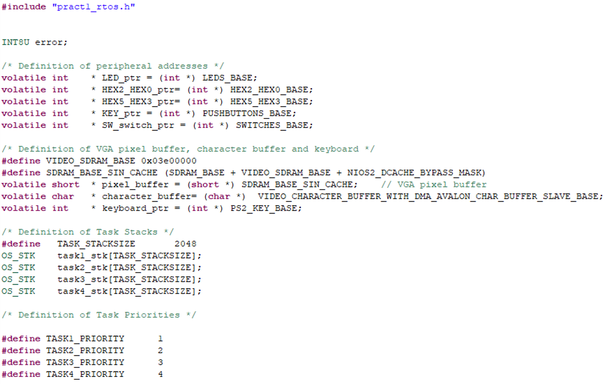
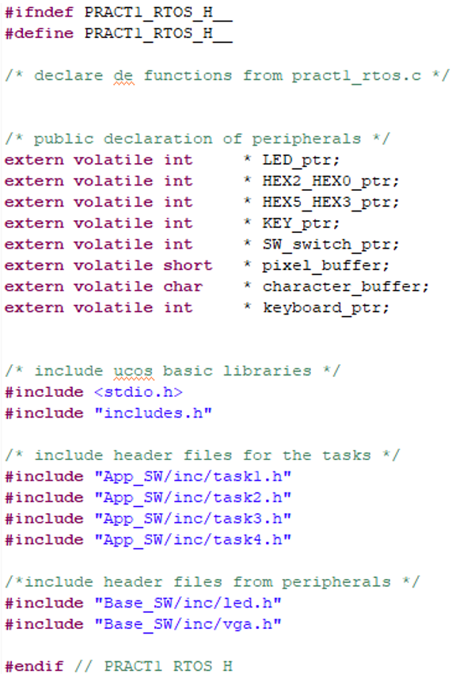
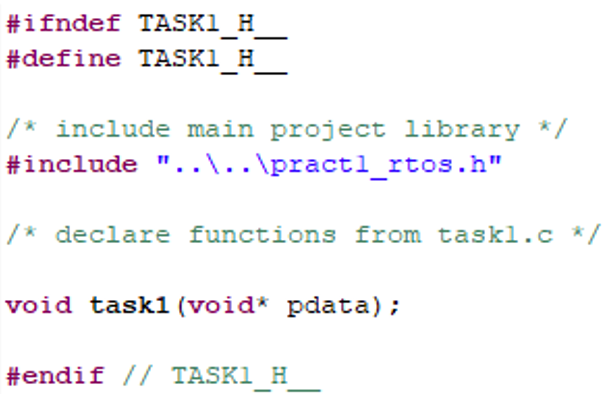
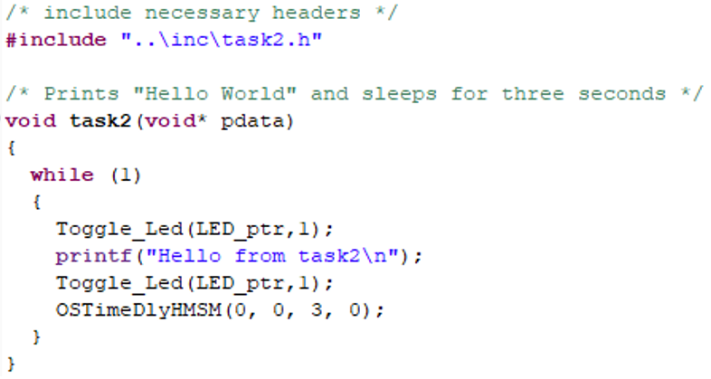

## EJERCICIO 3. DEFINICION DE PERIFERICOS. USO DE LEDS EN LAS TAREAS

Vamos a iniciar el uso de los perifericos en las tareas que tenemos programadas. Para ello hay que incluir todas las funciones que se van a usar, incorporando las librerias en el fichero de cabecera principal. En el fichero principal se definen los punteros a posiciones de memoria de los perifericos.

<div align="center">
	
	<br>
	<em>Figura 12. Fichero pract1_rtos.c, definicion de punteros de perifericos.</em>
</div>

<br>

### Ejemplo de codigo de ayuda (Figura 12)

```c
INT8U  error;

/* definition of peripheral addresses */
volatile int *LED_ptr = (int *) LEDS_BASE; // LED address
volatile int *SW_swith_ptr  = (int *) SWITCHES_BASE; // SW address
volatile int *KEY_ptr = (int *) PUSHBUTTONS_BASE; // KEY address
volatile int *HEX2_HEX0_ptr = (int *) HEX2_HEX0_BASE; // HEX3_HEX0 address
volatile int *HEX5_HEX3_ptr = (int *) HEX5_HEX3_BASE; // HEX5_HEX4 address


/* definition of VGA pixel buffer */
#define VIDEO_SDRAM_BASE  0x03E00000
#define SDRAM_BASE_SIN_CACHE (SDRAM_BASE + VIDEO_SDRAM_BASE + NIOS2_DCACHE_BYPASS_MASK)

volatile short *pixel_buffer = (short *) SDRAM_BASE_SIN_CACHE; // VGA pixel buffer address
volatile char *character_buffer = (char *) VIDEO_CHARACTER_BUFFER_WITH_DMA_AVALON_CHAR_BUFFER_SLAVE_BASE; // VGA character buffer address
volatile int *keyboard_ptr = (int *) PS2_KEY_BASE; // keyboard address

```

<br>

Y se deben hacer publicos en su fichero de cabecera, como se observa en la Figura 13.

<div align="center">
	
	<br>
	<em>Figura 13. Fichero de cabecera pract1_rtos.h.</em>
</div>

<br>

### Ejemplo de codigo de ayuda (Figura 13)

```c
#ifndef PRACT1_RTOS_H__ 
#define PRACT1_RTOS_H__

/* declaration of functions from pract1_rtos.c */

/* Definition of Task Priorities */

#define TASK1_PRIORITY      1
#define TASK2_PRIORITY      2
#define TASK3_PRIORITY      3
#define TASK4_PRIORITY      4

/* public declaration of peripherals */
extern volatile int 	* LED_ptr;
extern volatile int 	* HEX2_HEX0_ptr;
extern volatile int 	* HEX5_HEX3_ptr;
extern volatile int 	* KEY_ptr;
extern volatile int 	* SW_switch_ptr;
extern volatile short   * pixel_buffer;
extern volatile char 	* character_buffer;
extern volatile int	    * keyboard_ptr;


/* include ucos basic libraries */
#include <stdio.h>
#include <stdlib.h>
#include "includes.h"

extern INT8U error;

/* include header files for the tasks */
#include "App_SW/inc/task1.h"
#include "App_SW/inc/task2.h"
#include "App_SW/inc/task3.h"
#include "App_SW/inc/task4.h"

/*include header files from peripherals */
#include "Base_SW/inc/led.h"
#include "Base_SW/inc/vga.h"

#endif // PRACT1_RTOS_H__

```

<br>

Se deben incluir todas las librerias en `pract1_rtos.h` y que este sea el unico fichero a incluir en cada `.h` de las tareas.

<div align="center">
	
	<br>
	<em>Figura 14. Ejemplo de fichero de cabecera de la task1 (task1.h).</em>
</div>

<br>

### Ejemplo de codigo de ayuda (Figura 14)

```c
#ifndef TASK1_H__
#define TASK1_H__

/* include main project library */
#include "..\..\pract1_rtos.h"

/* declare functions from task1.c */

void task1(void* pdata);

#endif // TASK1_H__
```

Compile para verificar que las inclusiones de las librerias de perifericos no dan problemas.

Use los ficheros proporcionados en la practica de LEDs (`led.c` y `led.h`) para realizar las siguientes acciones:

- Use `Toggle_Led(LED_ptr,0);` antes y despues del `printf` de la `task1`, de forma que se encienda el LED 0 durante la ejecucion de la `task1`.
- Realice lo mismo para la `task2`, pero con el LED 1.
- La `task3`, que se ejecuta cada segundo, enciende todos los LEDs restantes al ejecutarse mediante `Led_ON_Some(LED_ptr,8,2);`.
- La `task4`, que se ejecuta cada 5 segundos, apaga los LEDs que enciende la `task3` mediante `Led_OFF_Some(LED_ptr,8,2);`.

<div align="center">
	
	<br>
	<em>Figura 15. Ejemplo de task2.c.</em>
</div>

<br>

### Ejemplo de codigo de ayuda (Figura 15)

```c
/* include necessary headers */
#include "..\inc\task2.h"

/* Prints "Hello World" and sleeps for three seconds */
void task2(void* pdata)
{
  while (1)
  { 
    Toggle_Led(LED_ptr,1);
    printf("Hello from task2\n");
    Toggle_Led(LED_ptr,1);

    OSTimeDlyHMSM(0, 0, 3, 0);
  }
}
```

Compile su proyecto y capture los resultados.

### Cuestiones

- Que indican los LEDs parpadeantes de las tareas 1 y 2?
- A que se debe la escasa duracion de su iluminacion?

[Ir Ejercicio 4](ex4.md)
[Volver a Indice](index.md)
