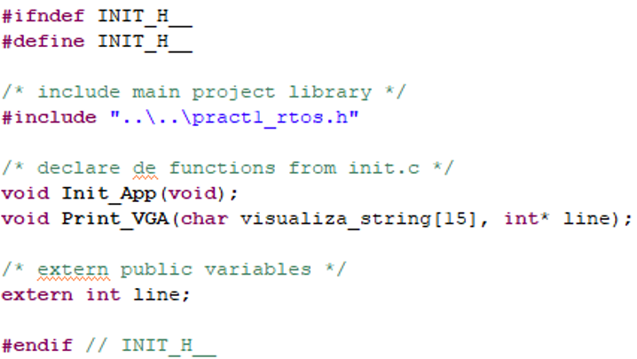
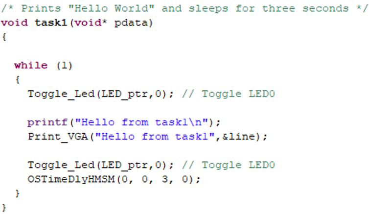
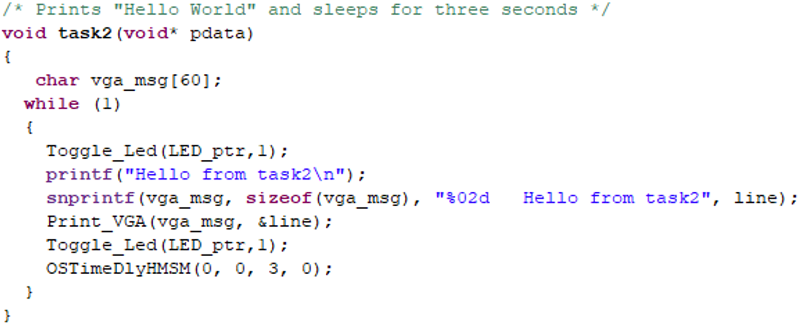

## EJERCICIO 4: USO DE VGA Y FUNCIONES NO REENTRANTES

Ahora vamos a inicializar la pantalla VGA y enviar mensajes por ella. Para ello creamos una función `Init_App()` en un fichero fuente llamado `init.c` que crearemos en `AppSW/src`. Añadiremos su correspondiente `init.h` en `AppSW/inc`.

Para ello use los ficheros `init.c` e `init.h` proporcionados en la práctica.

**Archivos para descargar:**

- [init.h](files_ucosii/init.h) - Archivo de cabecera con prototipos y variables globales
- [init.c](files_ucosii/init.c) - Archivo fuente con implementación de Init_App()

El fichero de cabecera `init.h` hará públicas las variables globales definidas en `init.c` así como los prototipos de funciones cuyo cuerpo se encuentre en `init.c`.

	
	 
	<em>Figura 16. Ejemplo de init.h</em>

 

Estudie el contenido de los ficheros `init.c` e `init.h`.

Incluya la llamada a la función `Init_App()` en `main` antes de la creación de las tareas.

Compile y verifique que la VGA funciona.

### Uso de Print_VGA() en las tareas

Introducimos el uso de `Print_VGA()` en las tasks de forma que envíen el mensaje por la VGA. Realice esto con todas las task y compruebe su funcionamiento.

	
	 
	<em>Figura 17. Mensajes por VGA desde Tasks.</em>

 

Compile y verifique el funcionamiento de los mensajes sobre VGA.

### Funciones no reentrantes

La función `Print_VGA()` nos permite escribir strings en la VGA desde una task. **Precaución** con esta función pues utiliza una variable global compartida entre tareas para poder saber la línea de escritura del mensaje.

**Preguntas de reflexión:**
- ¿Por qué se considera `Print_VGA()` una función no reentrante?
- ¿Qué solución se debe adoptar cuando en RTOS trabajamos con funciones no reentrantes?

### Inclusión de número de línea

Vamos a incluir el número de línea para que se visualice en la VGA. Para ello modifique las tasks de forma que puedan verse los números de línea como se muestra en el siguiente código ejemplo. De nuevo compile y ejecute sobre NIOSII.

	
	 
	<em>Figura 18. Inclusión de número de línea en código de task.</em>

 

**Importante:** Recuerde archivar su proyecto en Zip para no perder la versión actualizada de su trabajo hasta el momento (al menos como alternativa al uso de Git o sistemas de mantenimiento de versiones).

[Ir Ejercicio 5](ex5.md)
[Volver a Indice](index.md)