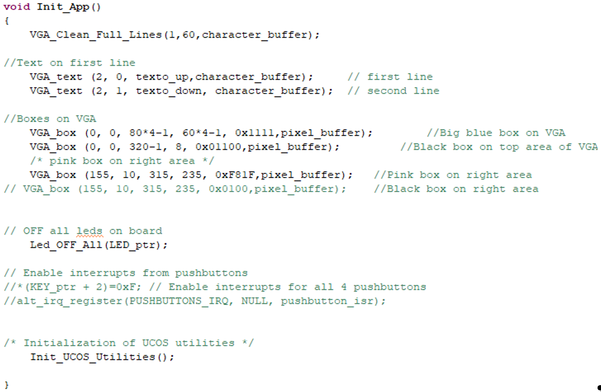
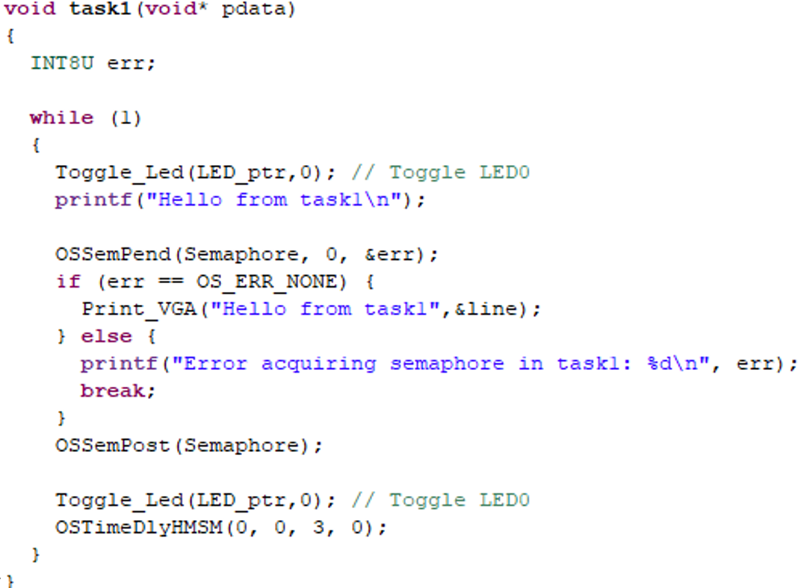

## EJERCICIO 5: FUNCIONES REENTRANTES, SECCIÓN CRÍTICA Y SEMÁFOROS. USO DE INTERRUPCIONES EN UCOSII
Ahora pasamos a ver cómo mejorar el sistema para que no se pueda utilizar la función no reentrante `Print_VGA()` por varias task al mismo tiempo. Suponiendo que una task es expulsada por otra cuando está en esta función las consecuencias pueden ser nefastas ya que la actualización de la variable global compartida no es segura. Ello podría ocurrir cuando una ISR se activa en el instante en que la task intenta usar `Print_VGA()`.

Una manera de asegurar el uso de la variable compartida es considerar el acceso a la función `Print_VGA()` como una **sección crítica** dentro de cada task y utilizar **semáforos**.

### Creación de semáforos
Para ello creamos un semáforo:
 
a) En `init.c` declaramos el puntero `OS_EVENT *Semaphore;` (descomente las líneas de declaración de semáforo) y creamos una función para creación de elementos de comunicación de tareas en UCOS (elimine comentarios para que se ejecute el servicio de creación de semáforos).
b) En `init.h` elimine el comentario para que se publique el semáforo creado.

	
	 
	<em>Figura 19. Creación de función UCOS_Utilities().</em>

 

`UCOS_Utilities()` forma parte de la inicialización del sistema y se ejecuta antes de crear las tasks al ser llamada en `Init_App()`.

	
	 
	<em>Figura 20. Inclusión de funciones de inicio en main().</em>

 

Así podemos usar el semáforo en todas las tareas que compartan la variable global "`line`".

	
	 
	<em>Figura 21. Uso de semáforo binario en una task.</em>

 

Utilícelo en todas las tareas que compartan la variable `line`. Compile y verifique el resultado.

**Preguntas de reflexión:**
- ¿Por qué se usa un semáforo binario y no uno de valor N?
- ¿Podría utilizarse un MUTEX?
- ¿Qué servicios de UCOS utilizaría con un MUTEX?
- ¿Cuál sería la prioridad de herencia que crearía en este caso al usar un MUTEX?

### Interrupciones de pulsadores

Ahora vamos a incluir interrupciones de pulsadores en nuestro sistema. Para ello copie los ficheros `isr.c` e `isr.h` entregados en la práctica en su carpeta `AppSW`. Estudie el contenido de ambos.

>![Note] "Descarga ficheros de atención a interrupción"
>
> - [isr.h](files_ucosii/isr.h) - Archivo de cabecera para rutinas de servicio de interrupción
> - [isr.c](files_ucosii/isr.c) - Archivo fuente con implementación de ISR para pulsadores

**Pasos a seguir:**
a) Active la habilitación de interrupciones de pulsadores eliminando los comentarios oportunos en el fichero `init.c`
b) Incluya la librería `init.h` en la inclusión de librerías de `pract1_rtos.h`
c) Compile y ejecute sobre NIOSII.

**Pregunta de reflexión:**
- ¿Qué servicios se utilizan para incorporar la ISR al scheduler de UCOSII?
