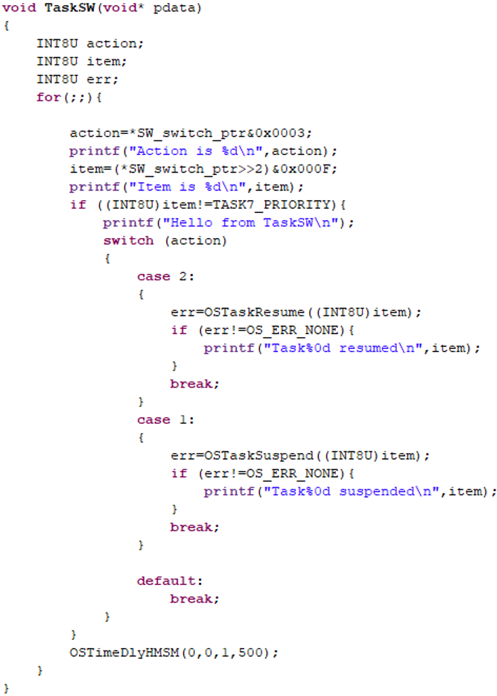

Una de las posibilidades de los RTOS es la suspensión de una tarea en ejecución y su recuperación mediante servicios del operativo.

### Implementación de TaskSW

Cree la tarea `TaskSW` que realice un polling de los SW cada 1,5 seg de forma que, cuando el SW0 se ponga a 1 se suspenda la tarea cuya prioridad está implícita en el valor de SW5-SW2.

Además, cuando el SW1 esté a 1 se recupera la tarea cuyo código se muestra en SW5-SW2.

**Importante:** Tenga presente que no debe permitir que la tarea se suspenda a sí misma ya que no podría recuperar las tareas suspendidas por ella.

<div align="center">
	
	<br>
	<em>Figura 22. Tarea que suspende y reactiva desde los switches.</em>
</div>

<br>

### Fichero TaskSW con las acciones de Suspensión y Recuperación
```c
#include "..\inc\tasksw.h"

/*
 * SW1:SW0 -> indicate the action: 00:none, 01:suspends, 10:resumes,11:none
 * SW5:SW2 -> indicate the PRIO of the task for the previous action
 * Note: the PRIO TASK7_PRIORITY has no effect (the task do not self suspends or self resumes)
 */
void TaskSW(void* pdata)
{
	INT8U action, action_old;
	INT8U item;
	INT8U err;
	for(;;){
		action_old=action;
		action=*SW_switch_ptr&0x0003;
		item=(*SW_switch_ptr>>2)&0x000F;
		if(action!=action_old){
			OSSemPend(Semaphore,0,&err);
			alt_ucosii_check_return_code(err);
			printf("Action is %d - ",action);
			printf("Item is %d\n",item);
			OSSemPost(Semaphore);
		}
		if ((INT8U)item!=TASK_SWITCH_PRIORITY){
			OSSemPend(Semaphore,0,&err);
			alt_ucosii_check_return_code(err);
			printf("Hello from TaskSW\n");
			OSSemPost(Semaphore);

			switch (action)
			{
				case 2:
				{
					err=OSTaskResume((INT8U)item);
					if (err!=OS_ERR_NONE){
						OSSemPost(Semaphore);
						alt_ucosii_check_return_code(err);
						printf("Task%0d resumed\n",item);
						OSSemPost(Semaphore);
						
					}
					break;
				}
				case 1:
				{
					err=OSTaskSuspend((INT8U)item);
					if (err!=OS_ERR_NONE){
						OSSemPend(Semaphore,0,&err);
						alt_ucosii_check_return_code(err);
						printf("Task%0d suspended\n",item);
						OSSemPost(Semaphore);
					}
					break;
				}

				default:
					break;
			}
		}

		// when SW8 is ON activates Flags
		/*
		if(*SW_switch_ptr&0x80){
			OSFlagPost(EventFlag,0x04,OS_FLAG_SET, &err);
			alt_ucosii_check_return_code(err);
		} else {
			OSFlagPost(EventFlag,0x04,OS_FLAG_CLR, &err);
			alt_ucosii_check_return_code(err);
		}
		*/
		OSTimeDlyHMSM(0,0,1,500);
	}
}
```
### Borrado de tareas

Añada la opción de borrado de tarea `OSTaskDel()` en caso de tener SW0 y SW1 a 1 ambos.

**Preguntas de reflexión:**
- ¿Cómo funcionan los servicios de suspensión y recuperación?, comente el funcionamiento.
- ¿Pueden suspenderse tareas de prioridad superior a la tarea desde la que se lanza la suspensión?

[Ir Ejercicio 8](ex8.md)
[Volver a Indice](index.md)