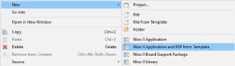
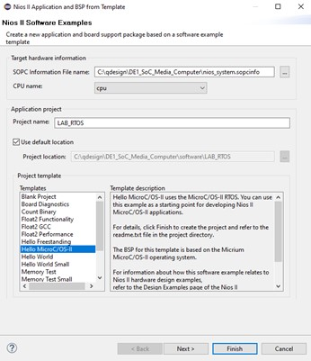
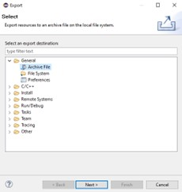
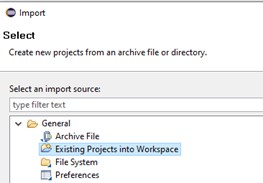

## OBJETIVOS
En esta práctica vamos a abordar los fundamentos de trabajo de un sistema operativo en tiempo real –RTOS.
Las prácticas se fundamentan en el uso de MicroC/OS-II, también conocido como uCOSII.
En esta asignatura uCOSII se asocia con la arquitectura de un softcore o microprocesador software de Intel, conocido como NIOS.

Se sobreentiende que para la realización de la práctica el alumno está familiarizado con el diseño de microprocesadores NIOS y sus periféricos mediante las herramientas de Intel_FPGA Platform Designer.
Asimismo, es necesario conocer IDE de ECLIPSE de Intel_FPGA, donde desarrollaremos nuestros ejemplos de programación con RTOS.

Las prácticas de uCOSII están pensadas inicialmente para poder ser ejecutadas sobre una tarjeta DE1-SoC con un fichero .sopc que permita acceder a todos los recursos hardware de dicha tarjeta, es decir la FPGA no solo dispondrá de NIOSII como procesador sino que existirán el resto de periféricos asociados a drivers que permitan el acceso a los recursos como memoria (FLASH, DRAM,…), VGA, teclado, LCD, Ethernet, audio y resto de componentes de DE1-SoC.

Sin embargo, también es posible ejecutar las prácticas en un entorno de simulación utilizando ModelSim, lo que permite desarrollar y probar el código sin necesidad de hardware físico. Esta flexibilidad facilita el aprendizaje y la experimentación con conceptos de sistemas operativos en tiempo real.

### Objetivos específicos

- **Comprensión de conceptos RTOS**: Familiarizarse con los principios fundamentales de los sistemas operativos en tiempo real
- **Manejo de MicroC/OS-II**: Aprender a utilizar las funcionalidades principales del kernel uCOSII
- **Integración hardware-software**: Entender la interacción entre el RTOS y la arquitectura NIOS
- **Desarrollo práctico**: Crear aplicaciones multitarea con gestión de recursos compartidos

## INICIO DE LA SESIÓN
Inicialmente vamos a crear nuestro primer proyecto con uCOSII, denominado LAB_RTOS. 

1. Descargue los ficheros SOPCINFO y SOF desde PoliformaT. Inicie Quartus. Programe el dispositivo mediante el fichero DE1_SoC_Media_Computer.sof.
2. Inicie ECLIPSE desde QuartusII mediante Tools->NIOSII Software Build Tools for Eclipse, el workspace indicado debe ser /DE1_SoC_Media_Computer/software.
3. Desde ECLIPSE File->New->NiosII Application and BSP from Template. Cargue el fichero .sopcinfo proporcionado en la práctica.

  
   
  <em>Figura 1. Creación de Proyecto Software desde Eclipse.</em>

4. Como nombre de proyecto escriba LAB_RTOS y como Template seleccione Hello MicroC/OS-II. Esta Template realiza la portabilidad de UCOS sobre nuestro proyecto NIOS.

  
   
  <em>Figura 2. Selección de plantilla "Hello MicroC" para importar UCOS en nuestro proyecto.</em>

Compile el proyecto LAB_RTOS y ejecútelo en la consola de NIOSII. Observe los mensajes que aparecen en consola: “Hello from Task1”..”Hello from Task2”.

## METODOLOGÍA DE ENTREGA DE LAS PRÁCTICAS
Para la entrega de las prácticas debe presentar un documento Word o PDF dónde indique brevemente los resultados obtenidos de cada ejercicio, para ello puede realizar capturas de pantalla de la consola de Eclipse, así como fotografías de la tarjeta DE1-SoC y la pantalla VGA donde se observen los resultados de cada ejercicio.

Asimismo, al finalizar la práctica, deben entregar junto con el PDF el fichero archivado del software desarrollado.
Para ello, seleccionando la carpeta de aplicación del proyecto, con el botón derecho del ratón pulse Export->General->Archive File.

  
   
  <em>Figura 3. Exportar proyecto software como ZIP.</em>

Puede archivar su proyecto tantas veces como quiera a lo largo de las sesiones de prácticas para no perder el trabajo realizado o para almacenar versiones .ZIP de las mismas.
Para recuperar el fichero ZIP en cualquier momento solo debe de importarlo como File/Import/General->Existing Projects into Workspace e indicar el directorio de trabajo habitual como "root" y seleccionar el .ZIP como fichero desde el que importar los proyectos.

  
   
  <em>Figura 4. Importar proyecto desde fichero ZIP en el workspace.</em>

La práctica debe entregarla cada alumno de forma individual, aunque el trabajo se puede realizar en grupos.

[Volver a Índice](index.md)